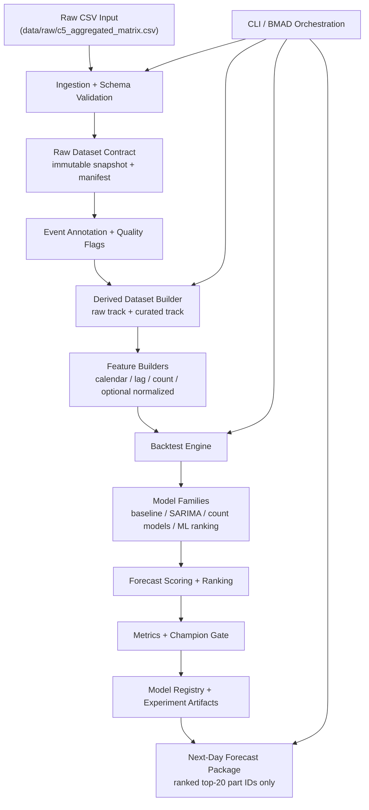
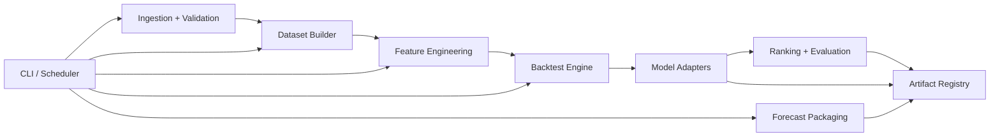
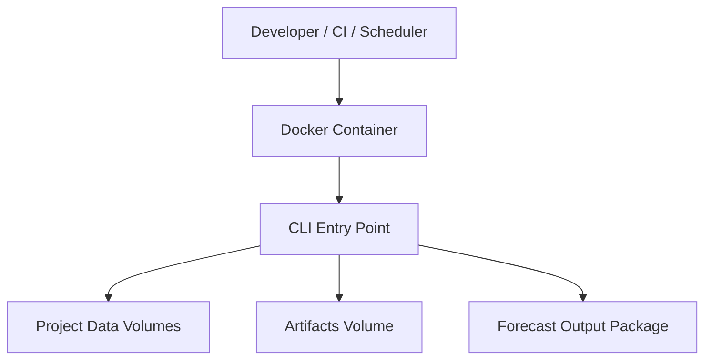

# c5_SARIMA_ML_model Architecture Document

## Introduction

This document defines the implementation architecture for **c5_SARIMA_ML_model** as a
greenfield, no-UI, batch forecasting and research platform. It is intended to guide
BMAD-based planning and execution inside Windsurf / Claude Code and to serve as the
authoritative technical blueprint for building, testing, and operating the project.

The architecture is intentionally centered on **data contract fidelity, rolling backtest
rigor, reproducibility, and champion/challenger model governance** rather than on a single
forecasting family. SARIMA/SARIMAX remains an important baseline candidate, but not the
governing architectural assumption.

### Relationship to the PRD

This architecture implements the intent of the current PRD:

- preserve the raw dataset exactly as received
- treat the validated 25- and 35-output dates as real operating-condition events
- never allow literal `0` to appear in the predicted next-event top-20 part IDs
- prioritize ranking quality, calibration, and reproducible backtesting over cosmetic
  model complexity
- keep MVP scope limited to a modular batch service with no UI / web application

### Starter Template or Existing Project

**Decision:** No application starter template will be used.

**Current repository state:** The uploaded repository is a planning scaffold, not an
existing implementation. It already contains BMAD core assets, web bundles, a senior
representative playbook, one raw dataset, and several Perplexity-produced starter PDFs.
It does **not** yet contain production source code, tests, CI workflows, build scripts,
containers, or operational runbooks.

**Implication:** The project should be implemented as a **greenfield service/research
platform with legacy reference inputs**, not as a brownfield application retrofit.

## Change Log

| Date | Version | Description | Author |
| --- | --- | --- | --- |
| 2026-03-30 | v0.1 | Initial implementation architecture aligned to validated PRD and dataset reality | OpenAI |

## High Level Architecture

### Technical Summary

The system will be implemented as a **Python modular monolith in a monorepo** with a
batch-first execution model. Its major subsystems are data intake and validation,
dataset curation and annotation, feature generation, experiment execution, model
training, next-day forecasting, ranking/evaluation, and artifact governance. The
architecture uses immutable raw inputs, versioned derived datasets, configuration-driven
pipelines, and explicit champion/challenger comparison so that experimental work remains
auditable and reproducible. This directly supports the PRD goal of building a rigorous
forecasting platform without prematurely overbuilding UI or platform infrastructure.

### High Level Overview

1. **Architecture style:** Modular monolith with batch workflows.
2. **Repository style:** Monorepo.
3. **Service style:** Internal CLI-first forecasting and experimentation service.
4. **Primary interaction mode:** A developer or BMAD-controlled agent runs a pipeline
   command to validate data, build derived datasets, backtest model candidates, register
   experiment results, and optionally generate a next-day forecast package.
5. **Core design choice:** Optimize for correctness, comparability, and maintainability
   before optimizing for serving latency or distributed scale.

### High Level Project Diagram



### Architectural and Design Patterns

#### 1. Modular Monolith

- **Chosen pattern:** Modular monolith
- **Alternatives considered:** Microservices; notebook-only workflow
- **Rationale:** There is not enough operational complexity yet to justify networked
  services, but the project already needs stronger structure than a notebook-only
  research sandbox. A modular monolith keeps code boundaries explicit while preserving
  fast iteration and simple local execution.

#### 2. Batch-First Pipeline Architecture

- **Chosen pattern:** Batch-first CLI pipelines
- **Alternatives considered:** REST service first; ad hoc notebooks only
- **Rationale:** The core use case is next-day forecast generation and rolling-origin
  backtesting, both of which are naturally batch-oriented. A CLI pipeline is easier to
  test, automate, containerize, and later schedule than a premature API.

#### 3. Ports-and-Adapters at Module Boundaries

- **Chosen pattern:** Internal ports/adapters abstraction
- **Alternatives considered:** Fully concrete module coupling
- **Rationale:** Data loading, model registry, persistence, and forecast packaging are
  likely to evolve. Thin interfaces allow the team to replace local filesystem adapters
  with cloud or database adapters later without rewriting domain logic.

#### 4. Immutable Raw Data + Versioned Derived Data

- **Chosen pattern:** Immutable raw zone, versioned derived zones
- **Alternatives considered:** In-place mutation of cleaned datasets
- **Rationale:** The project explicitly needs auditability around exceptional dates and
  curation choices. Derived datasets must always be reproducible from a frozen raw input
  plus a documented transformation manifest.

#### 5. Champion / Challenger Model Governance

- **Chosen pattern:** Metric-gated model promotion
- **Alternatives considered:** Manual “best looking output” selection
- **Rationale:** The target is easy to overstate with weak metrics. Promotion must depend
  on reproducible backtests, explicit evaluation thresholds, and saved comparison
  artifacts.

#### 6. Configuration-Driven Execution

- **Chosen pattern:** YAML-driven experiments and runs
- **Alternatives considered:** Hard-coded script arguments only
- **Rationale:** BMAD-controlled work benefits from explicit, diffable run
  configurations. Configuration files also simplify CI execution and experiment replay.

## Tech Stack

### Cloud / Infrastructure Position for MVP

- **Primary execution environment:** Local workstation and developer-controlled batch
  containers
- **Initial deployment mode:** Docker-based local / scheduled execution
- **Cloud requirement at MVP:** None required
- **Future-compatible posture:** Can later move to GitHub Actions runners, cron-hosted
  VMs, or container jobs without changing core domain logic

### Technology Stack Table

| Category | Technology | Version | Purpose | Rationale |
| --- | --- | --- | --- | --- |
| Language | Python | 3.11.15 | Primary implementation language | Stable scientific ecosystem, strong time-series and data tooling, and compatible with batch-oriented research workflows |
| Packaging / dependency management | Poetry | 2.0.x | Locking and dependency management | Reproducible installs and clean environment handling |
| Project metadata / build backend | `pyproject.toml` | PEP 621 | Build and tool configuration | Single source of truth for package, tools, and dependency groups |
| DataFrame / tabular processing | pandas | 3.0.1 | Data ingestion, validation, reshaping | Mature dataframe operations and time-series indexing |
| Numerical computing | NumPy | 2.2.x | Vectorized math and array operations | Core numerical foundation for feature and metric computation |
| Time-series classical modeling | statsmodels | 0.14.6 | SARIMA / SARIMAX and diagnostics | Strong baseline library for classical statistical forecasting |
| ML baselines and ranking challengers | scikit-learn | 1.6.x | Ranking/classification/regression baselines | Widely used baseline framework with dependable cross-validation utilities |
| Gradient boosting challenger | XGBoost | 2.1.x | Strong nonlinear challenger family | Good structured-data performance and useful feature importance tooling |
| Serialization | joblib | 1.4.x | Persist fitted lightweight artifacts | Simple model and transformer persistence |
| Config validation | pydantic | 2.11.x | Typed config models | Reduces silent runtime errors in experiment configs |
| CLI | Typer | 0.16.x | Pipeline command interface | Clean typed CLI with minimal boilerplate |
| Logging | structlog | 25.2.x | Structured logs | Makes experiment and batch logs easier to inspect and parse |
| Experiment artifact format | JSON / YAML / Parquet | N/A | Configs, manifests, outputs | Human-readable metadata and efficient tabular outputs |
| Dataset columnar storage | PyArrow | 20.0.x | Parquet read/write | Fast and interoperable artifact storage |
| Visualization | Matplotlib | 3.10.x | Diagnostic and evaluation plots | Simple, dependable plotting without UI framework overhead |
| Testing | pytest | 8.4.x | Unit and integration tests | Standard Python testing foundation |
| Coverage | pytest-cov | 6.1.x | Coverage reporting | Required for CI quality gate |
| Linting / formatting | Ruff | 0.11.x | Lint + format | Fast unified code quality tooling |
| Static typing | mypy | 1.15.x | Type checking | Improves maintainability for agent-assisted development |
| Containers | Docker | 28.x | Reproducible batch runtime | Simplifies local and CI execution |
| CI | GitHub Actions | N/A | Automated checks and scheduled runs | Natural fit for lightweight CI and nightly batch jobs |

### Tech Stack Decisions to Preserve

1. Use **Python 3.11** rather than jumping to a newer feature branch during MVP.
2. Prefer **filesystem-backed artifact storage** over adding a database or MLflow too
   early.
3. Keep **Docker + GitHub Actions** as the only MVP operational platform commitments.
4. Treat **notebooks as exploratory only**, never as the authoritative production path.

## Data Models

### RawDailyPartUsage

**Purpose:** Immutable representation of the source file row.

**Key Attributes:**

- `date: date` - Event date, unique in the dataset
- `P_1` .. `P_39: int` - Non-negative count for each part ID on that day
- `row_total: int` - Derived validation field equal to the sum of `P_1..P_39`
- `source_hash: str` - Hash of the source snapshot used during ingestion

**Relationships:**

- One raw row maps to one annotated row
- One raw snapshot can generate many derived datasets

### AnnotatedDailyPartUsage

**Purpose:** Adds validation and operating-condition context without modifying the raw
counts.

**Key Attributes:**

- `date: date`
- `row_total: int`
- `total_class: str` - e.g. `reduced_output`, `standard_output`, `additional_output`
- `quality_flags: list[str]` - Validation or informational flags
- `domain_event_label: str | null` - Confirmed business explanation if known
- `is_exception_day: bool`

**Relationships:**

- Produced from `RawDailyPartUsage`
- Used by dataset builders and downstream evaluation segmentation

### DerivedDatasetManifest

**Purpose:** Versioned definition of a usable dataset variant.

**Key Attributes:**

- `dataset_id: str`
- `variant_name: str` - e.g. `raw_v1`, `curated_v1`, `normalized_30_only_v1`
- `source_snapshot_id: str`
- `build_timestamp: datetime`
- `transform_steps: list[str]`
- `included_dates: int`
- `excluded_dates: int`
- `notes: str`

**Relationships:**

- One manifest describes one materialized dataset output
- Each experiment references exactly one dataset manifest

### FeatureMatrixManifest

**Purpose:** Documents feature generation choices for a model run.

**Key Attributes:**

- `feature_set_id: str`
- `dataset_id: str`
- `feature_family: str`
- `lag_spec: dict`
- `calendar_spec: dict`
- `normalization_spec: dict | null`
- `target_definition: str`

**Relationships:**

- Built from a derived dataset
- Referenced by experiment runs and forecast packages

### ExperimentRun

**Purpose:** Immutable record of a training or backtest execution.

**Key Attributes:**

- `run_id: str`
- `model_family: str`
- `config_path: str`
- `dataset_id: str`
- `feature_set_id: str`
- `time_window: dict`
- `seed: int | null`
- `status: str`
- `metrics_summary_path: str`
- `artifact_paths: list[str]`

**Relationships:**

- Linked to one dataset manifest and one feature manifest
- Produces one or more forecast result artifacts

### ForecastPackage

**Purpose:** Canonical next-day forecast deliverable.

**Key Attributes:**

- `forecast_date: date`
- `run_id: str`
- `part_rankings_path: str`
- `top20_part_ids: list[int]`
- `scores_definition: str`
- `contains_zero_part_id: bool` - must always be `false`
- `generation_timestamp: datetime`

**Relationships:**

- Produced from one approved model run
- Consumed by planners or downstream automation

## Components

### 1. Ingestion and Validation Module

**Responsibility:** Load the raw CSV, validate schema and value constraints, and create
the immutable source snapshot metadata.

**Key Interfaces:**

- `validate-raw`
- `build-source-manifest`

**Dependencies:** pandas, pydantic, filesystem adapters

**Technology Stack:** Python, pandas, PyArrow, Typer

### 2. Annotation and Dataset Builder Module

**Responsibility:** Attach known domain-event labels, derive row totals, generate quality
flags, and materialize named dataset variants.

**Key Interfaces:**

- `annotate-dataset`
- `build-dataset --variant <name>`

**Dependencies:** ingestion module, manifest utilities

**Technology Stack:** Python, pandas, pydantic

### 3. Feature Engineering Module

**Responsibility:** Produce reusable feature matrices for baseline, classical, and machine
learning candidates.

**Key Interfaces:**

- `build-features --feature-set <name>`
- feature family registry for lag, rolling, calendar, sparsity, and optional normalization
  transforms

**Dependencies:** dataset builder

**Technology Stack:** Python, pandas, NumPy, PyArrow

### 4. Backtest Engine

**Responsibility:** Execute rolling-origin evaluation windows with reproducible slicing and
store per-window predictions.

**Key Interfaces:**

- `run-backtest --config <path>`
- `compare-runs --run-a <id> --run-b <id>`

**Dependencies:** feature module, model interfaces, evaluation module

**Technology Stack:** Python, pandas, NumPy

### 5. Model Family Adapters

**Responsibility:** Provide a common fit / predict / serialize interface across baseline,
SARIMA/SARIMAX, count-aware, and ML ranking candidates.

**Key Interfaces:**

- `fit(dataset, features, config)`
- `predict_next(history)`
- `predict_window(window_spec)`
- `save_artifacts()`

**Dependencies:** statsmodels, scikit-learn, XGBoost, joblib

**Technology Stack:** Python modeling libraries behind a common internal protocol

### 6. Ranking and Evaluation Module

**Responsibility:** Convert model outputs into ranked part lists, compute metrics, enforce
the no-zero-part-ID rule, and produce champion/challenger comparisons.

**Key Interfaces:**

- `score-forecast`
- `rank-parts`
- `evaluate-run`
- `promote-champion`

**Dependencies:** backtest engine, model adapters, manifests

**Technology Stack:** Python, pandas, NumPy

### 7. Artifact Registry Module

**Responsibility:** Persist manifests, metrics summaries, model metadata, diagnostic plots,
and forecast packages in a deterministic folder structure.

**Key Interfaces:**

- `register-run`
- `get-current-champion`
- `package-forecast`

**Dependencies:** all pipeline modules

**Technology Stack:** Filesystem + JSON/YAML/Parquet conventions

### 8. CLI and Pipeline Orchestration Layer

**Responsibility:** Expose all workflows as explicit commands suitable for BMAD-driven
execution, local development, CI, and scheduled jobs.

**Key Interfaces:**

- `forecasting validate-raw`
- `forecasting build-dataset`
- `forecasting build-features`
- `forecasting run-backtest`
- `forecasting train-model`
- `forecasting forecast-next-day`
- `forecasting package-forecast`

**Dependencies:** all internal modules

**Technology Stack:** Typer, structured logging, Docker entrypoints

### Component Diagram



## External APIs

None for MVP.

The architecture should assume **no required external API dependency** during initial
implementation. Optional future integrations, such as notifications, cloud object storage,
or experiment tracking services, must be added behind adapters and kept out of the core
domain modules.

## Core Data Flow

### Flow 1: Raw Intake and Dataset Build

1. Read the raw CSV from `data/raw/`.
2. Validate required columns, date uniqueness, non-negative integers, and row totals.
3. Generate source snapshot manifest and row-level validation report.
4. Annotate confirmed exception dates and quality flags.
5. Build one or more named dataset variants:
   - `raw_v1`
   - `curated_v1`
   - optional `normalized_reference_v1` for controlled experiments only

### Flow 2: Backtest Execution

1. Select dataset variant and feature set.
2. Resolve rolling-origin windows from config.
3. Fit each model family on each window.
4. Predict the next event for each window.
5. Produce ranked part lists from valid part IDs `1..39` only.
6. Calculate metrics and save comparison reports.
7. Gate promotion based on PRD thresholds.

### Flow 3: Next-Day Forecast Package

1. Resolve the currently approved champion configuration.
2. Rebuild or load the required feature state.
3. Produce the next-event part ranking.
4. Select the top 20 ranked valid part IDs.
5. Assert that `0` is absent from `top20_part_ids`.
6. Package scores, metadata, diagnostics, and manifest references.

## Domain Rules and Guardrails

### Hard Business / Domain Rules

1. Valid part identifiers for ranking are **1 through 39 only**.
2. Literal `0` may appear as a historical **count** in the matrix, but must never appear
   as a predicted next-event part identifier.
3. The confirmed 25- and 35-total days remain in the raw dataset as legitimate
   operating-condition events.
4. The project must support evaluation on both the full raw track and curated tracks.
5. Duplicate dates are invalid.
6. Missing days inside the observed historical span are invalid unless a future source
   system explicitly documents them.

### Forecast Output Rules

1. Forecast output must include a machine-readable ranked table for all 39 parts.
2. The published forecast package must include exactly 20 top-ranked part IDs.
3. Ties must be broken deterministically.
4. Each forecast package must identify the dataset variant, feature set, model family, and
   run ID used to create it.

## Data Storage and Artifact Layout

### Canonical Folders

```text
docs/
  prd.md
  architecture.md
  architecture/
    tech-stack.md
    source-tree.md
    coding-standards.md

data/
  raw/
  interim/
  processed/
  features/
  forecasts/

artifacts/
  manifests/
  runs/
  models/
  metrics/
  plots/
  champion/

configs/
  datasets/
  features/
  models/
  runs/

src/
  c5_forecasting/

tests/
  unit/
  integration/
  regression/
```

### Storage Rules

- `data/raw/` is immutable after intake.
- `data/interim/` contains annotated but not final derived outputs.
- `data/processed/` contains named dataset variants with manifest references.
- `artifacts/champion/` contains only the approved active champion pointers, never the
  sole copy of model artifacts.
- Every persisted artifact path must be derivable from `run_id` or `dataset_id`.

## Source Tree Recommendation

```text
c5_SARIMA_ML_model/
├── README.md
├── pyproject.toml
├── poetry.lock
├── .env.example
├── .gitignore
├── docs/
│   ├── prd.md
│   ├── architecture.md
│   ├── architecture/
│   │   ├── tech-stack.md
│   │   ├── source-tree.md
│   │   └── coding-standards.md
│   ├── stories/
│   └── qa/
├── configs/
│   ├── datasets/
│   ├── features/
│   ├── models/
│   └── runs/
├── data/
│   ├── raw/
│   ├── interim/
│   ├── processed/
│   ├── features/
│   └── forecasts/
├── artifacts/
│   ├── manifests/
│   ├── runs/
│   ├── models/
│   ├── metrics/
│   ├── plots/
│   └── champion/
├── src/
│   └── c5_forecasting/
│       ├── cli/
│       ├── config/
│       ├── domain/
│       ├── data/
│       ├── features/
│       ├── models/
│       ├── ranking/
│       ├── evaluation/
│       ├── registry/
│       └── pipelines/
├── tests/
│   ├── unit/
│   ├── integration/
│   └── regression/
├── docker/
│   ├── Dockerfile
│   └── entrypoint.sh
└── .github/
    └── workflows/
```

## Module-Level Design

### `config`

- typed config models
- path resolution
- environment overrides
- config loading and validation

### `domain`

- dataset manifest models
- experiment run models
- forecast package models
- enums and domain constants
- hard business rules, including valid part ID range

### `data`

- CSV loading
- schema validation
- source hashing
- annotation and dataset materialization
- parquet persistence helpers

### `features`

- lag features
- rolling window statistics
- calendar features
- sparsity / activity features
- optional normalized-track transforms for controlled experiments

### `models`

- baseline adapters
- SARIMA / SARIMAX adapters
- count-aware adapters
- ML ranking adapters
- serialization helpers

### `ranking`

- score normalization
- deterministic sorting and tie-breaking
- top-20 selection
- forecast packaging helpers

### `evaluation`

- rolling-origin slicing
- ranking metrics
- count metrics
- calibration metrics
- run comparison and gate logic

### `registry`

- artifact manifests
- champion pointer
- report indexing
- model lookup

### `pipelines`

- validate raw
- build dataset
- build features
- run backtest
- train champion
- forecast next day
- package outputs

## Modeling Strategy Architecture

### Baseline Ladder

The implementation must support a clear progression:

1. frequency-only and persistence baselines
2. calendar-aware baselines
3. SARIMA / SARIMAX classical baselines
4. count-aware statistical challengers
5. machine-learning ranking challengers
6. optional ensemble logic

No candidate is allowed to skip the common evaluation interface.

### Normalization Policy

The system must not assume that every event total equals 30. Instead, it must support two
separate experimental postures:

- **native-count posture:** uses the observed row totals exactly as recorded
- **controlled-normalization posture:** optional derived-track experiment that normalizes
  or filters rows for methodological comparison only

This prevents the architecture from baking a false domain invariant into the core data path.

### No-Zero Prediction Enforcement

Every ranking adapter must pass through a validation step that guarantees:

- only part IDs `1..39` appear in ranking outputs
- no null, negative, or `0` part ID appears in any final published forecast package
- any violation fails the run and blocks promotion

## Observability, Diagnostics, and Quality Gates

### Logging

- Structured logs for every pipeline stage
- Run IDs included in all log lines
- Explicit warnings for dataset exceptions, missing artifacts, and promotion failures

### Required Artifacts per Run

- resolved config snapshot
- dataset manifest
- feature manifest
- metrics summary
- ranked forecast tables
- diagnostic plots
- serialized model artifacts, if applicable

### Quality Gates

A run is not eligible for champion promotion unless:

1. required artifacts exist
2. tests passed
3. backtest completed without data contract violations
4. the no-zero forecast rule passed
5. promotion metrics exceeded the currently configured gate

## Security and Operational Posture

### MVP Security Posture

- No public API surface
- No user authentication requirement at MVP
- No secrets required beyond optional environment configuration
- All write operations restricted to project-controlled directories

### Future Security Hooks

- secret management through environment variables or CI secrets
- artifact signing or checksum verification for release outputs
- role-based access only if later externalized as a service

## Testing Strategy

### Required Test Layers

1. **Unit tests** for validators, feature builders, ranking logic, and config parsing
2. **Integration tests** for end-to-end pipeline commands against a fixture dataset
3. **Regression tests** for metrics, tie-breaking, and no-zero forecast enforcement
4. **Artifact tests** to assert required files and schema outputs exist after runs

### Special Regression Targets

- validated exception dates remain preserved through raw and annotated tracks
- deterministic top-20 ordering
- row total handling for 25, 30, and 35 output days
- champion promotion only when gate conditions are met

## Deployment View

### MVP Deployment Model

The project will be deployed as one containerized batch application with multiple commands.
The same image should support local use, CI use, and scheduled execution.

### Execution Modes

- **Developer mode:** run commands locally through Poetry / Docker
- **CI mode:** run lint, type checks, tests, and smoke backtests in GitHub Actions
- **Scheduled mode:** run forecast packaging on a cron-like trigger once the champion
  process is stable

### Deployment Diagram



## Tradeoffs and Deferred Decisions

### Intentional MVP Omissions

- no REST API
- no web dashboard
- no external database
- no full experiment tracking platform
- no distributed training stack
- no GPU dependency

### Deferred Decisions for Later Epics

- whether MLflow or a database-backed registry is worth the added complexity
- whether next-day forecasting should later expose an internal API
- whether more advanced probabilistic ranking models outperform simpler challengers enough
  to justify operational complexity

## Architecture Risks and Mitigations

### Risk 1: Metric inflation from weak ranking targets

**Mitigation:** enforce PRD metrics that focus on calibrated ranking quality, comparison to
naive baselines, and segmented evaluation.

### Risk 2: Overfitting to one modeling family

**Mitigation:** preserve model adapter parity and a mandatory baseline ladder.

### Risk 3: Silent loss of domain context around validated exception days

**Mitigation:** keep domain-event labels and exception flags inside manifests and reports.

### Risk 4: Tooling sprawl too early

**Mitigation:** hold the line on one language, one container image, one registry approach,
and one CI platform until the model layer proves value.

## Architecture Readiness for BMAD Execution

This architecture is ready to support BMAD sharding and story generation once it is placed
at `docs/architecture.md` and paired with the PRD at `docs/prd.md`.

### Required Supporting Documents

The following supporting documents should be generated from this architecture and kept in
sync:

- `docs/architecture/tech-stack.md`
- `docs/architecture/source-tree.md`
- `docs/architecture/coding-standards.md`

### Architect-to-PM Feedback for PRD

The architecture does **not** require a rewrite of the current epic sequence. It does,
however, reinforce the following implementation priorities:

1. build the dataset contract and manifest system before model development
2. build the common evaluation interface before adding multiple candidate families
3. keep normalization experiments behind explicit dataset variants
4. implement no-zero forecast enforcement as a hard validator, not a soft convention

## Suggested BMAD Handoff Prompt

Use this after saving the PRD and architecture into the repo:

> As BMad PO, validate `docs/prd.md` and `docs/architecture.md` for alignment with the
> greenfield-service workflow. Then shard both documents. After sharding, prepare the
> first implementation story from Epic 1 focused on executable project skeleton,
> immutable raw-data validation, and dataset manifest creation. Do not skip validation,
> do not add UI work, and do not assume every daily row total is 30. Then stop.
